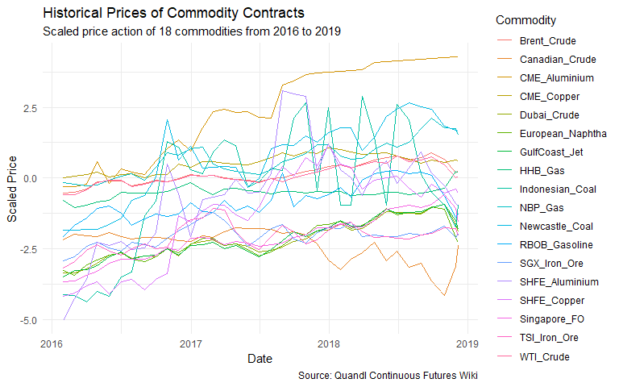
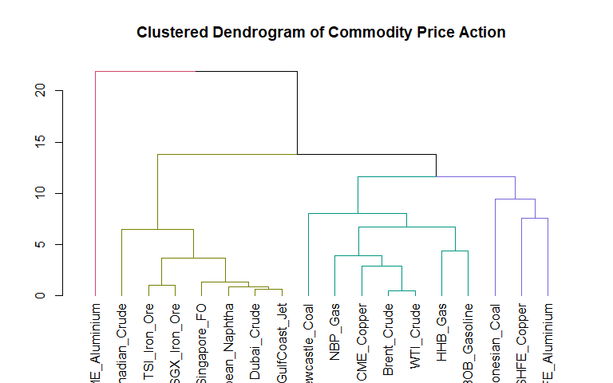
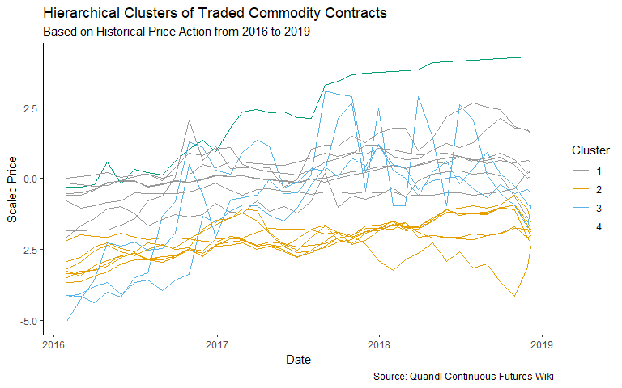
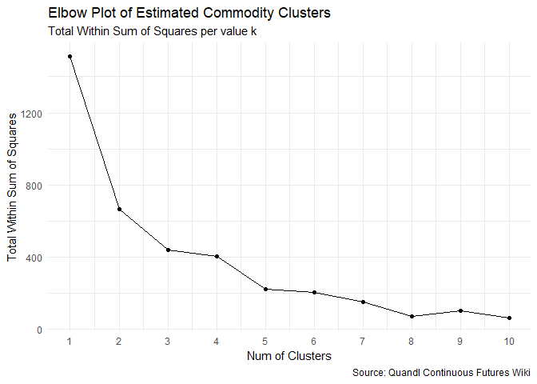
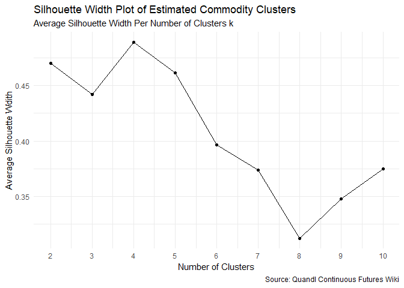
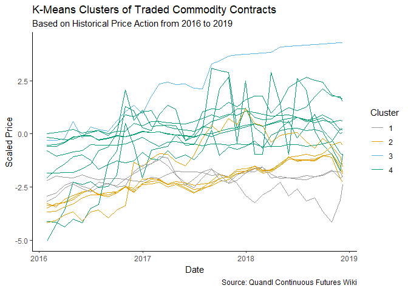

Unsupervised Learning with Commodity Prices
================
Last updated on 2019-07-13

  - [Summary](#summary)
  - [Package Installs](#package-installs)
  - [Code](#code)
      - [1. Import Data](#import-data)
      - [2. Preprocess Data](#preprocess-data)
      - [3. Hierarchical Clustering](#hierarchical-clustering)
      - [4. K-Means Clustering: K
        Estimation](#k-means-clustering-k-estimation)
      - [5. K-Means Clustering: Cluster
        Assignment](#k-means-clustering-cluster-assignment)
      - [6. Conclusions](#conclusions)
          - [Cluster 4: CME Alumnium](#cluster-4-cme-alumnium)
          - [Cluster 2: Brent, WTI, Henry Hub Gas, NBP
            Gas](#cluster-2-brent-wti-henry-hub-gas-nbp-gas)
          - [Cluster 3: Dubai Crude, SGX Fuel Oil, SHFE Copper, Iron
            Ore](#cluster-3-dubai-crude-sgx-fuel-oil-shfe-copper-iron-ore)
          - [Use-Cases](#use-cases)

## Summary

This project attempts to utilize methods in Unsupervised Learning to
deduce and infer similarities in the trading behaviour of commodity
contracts. Specifically, it uses Hierarchical Clustering and K-Means
Algorithms to investigate if different commodity contracts may be
clustered into reasonable sub-groups.

## Package Installs

``` r
library(cluster)
library(dendextend)
library(naniar)
library(Quandl)
library(tidyverse)
library(xts)
```

## Code

### 1\. Import Data

``` r
# Load the Quandl API Key
Quandl.api_key("rn2xyN_hG9XfxN_9ibFJ")

# Define a vector of Commodity Names
names <- c("Brent_Crude", "WTI_Crude", "Dubai_Crude", "Canadian_Crude", "HHB_Gas", "NBP_Gas", "RBOB_Gasoline", "European_Naphtha", "GulfCoast_Jet", "Singapore_FO", "CME_Copper", "SHFE_Copper", "TSI_Iron_Ore", "SGX_Iron_Ore", "Newcastle_Coal", "Indonesian_Coal", "CME_Aluminium", "SHFE_Aluminium")

# Define a vector of Quandl Codes per Commodity
codes <- c("CHRIS/ICE_B1", "CHRIS/CME_CL1", "CHRIS/CME_DC1", "CHRIS/CME_WCC1", "CHRIS/CME_NG1", "CHRIS/ICE_M1","CHRIS/CME_RB1", "CHRIS/CME_UN1", "CHRIS/CME_GE1", "CHRIS/CME_UA1", "CHRIS/CME_HG1", "CHRIS/SHFE_CU1", "CHRIS/CME_TIO1", "CHRIS/SGX_FEF1", "CHRIS/ICE_NCF1", "CHRIS/CME_MCC1", "CHRIS/CME_ALI1", "CHRIS/SHFE_AL1")

# Create a data.frame to store commodity contract codes
commod_info <- data.frame(
  name = names,
  code = codes,
  stringsAsFactors = FALSE
)

# View the first 6 rows of commodities
head(commod_info)
```

    ##             name           code
    ## 1    Brent_Crude   CHRIS/ICE_B1
    ## 2      WTI_Crude  CHRIS/CME_CL1
    ## 3    Dubai_Crude  CHRIS/CME_DC1
    ## 4 Canadian_Crude CHRIS/CME_WCC1
    ## 5        HHB_Gas  CHRIS/CME_NG1
    ## 6        NBP_Gas   CHRIS/ICE_M1

``` r
# Create an empty list to store historical prices per commodity: df_list
df_list <- list()

# Iterate through commod_info and add to df_list
for (i in 1:nrow(commod_info)) {
  df_list[[i]] <- Quandl(commod_info$code[i])
}
```

### 2\. Preprocess Data

``` r
# Reduce all data.frames in df_list into a single object: com
com <- df_list %>% 
  reduce(left_join, by = "Date") %>% 
  select(matches("Date|Settle")) %>% 
  select(-"Pre Settle.x", -"Pre Settle.y")

# Define column names as full commodity name
names(com) <- c("Date", commod_info$name)

# Impute missing NA values with LOCF
com <- na.locf(com)

# View the first 10 observations of com
head(com, n = 10)
```

    ##           Date Brent_Crude WTI_Crude Dubai_Crude Canadian_Crude HHB_Gas
    ## 153 2018-12-07       61.67     52.61      60.204        -18.081   4.488
    ## 154 2018-12-06       60.06     51.49      59.211        -19.719   4.327
    ## 155 2018-12-05       61.56     52.89      60.457        -21.216   4.469
    ## 156 2018-12-04       62.08     53.25      65.561        -23.692   4.457
    ## 157 2018-12-03       61.69     52.95      65.561        -24.576   4.339
    ## 158 2018-11-30       59.46     50.93      65.561        -28.500   4.612
    ## 159 2018-11-29       59.51     51.45      65.591        -30.000   4.646
    ## 160 2018-11-28       58.76     50.29      65.516        -33.000   4.715
    ## 161 2018-11-27       60.21     51.56      65.590        -34.250   4.262
    ## 162 2018-11-26       60.48     51.63      65.627        -33.750   4.248
    ##     NBP_Gas RBOB_Gasoline European_Naphtha GulfCoast_Jet Singapore_FO
    ## 153   63.30        1.4858          478.999        1.7866      391.412
    ## 154   62.97        1.4334          469.926        1.7603      384.809
    ## 155   64.80        1.4456          479.009        1.7849      398.714
    ## 156   66.95        1.4434          505.591        1.9534      404.593
    ## 157   68.77        1.4314          505.591        1.9534      443.693
    ## 158   67.54        1.4413          505.591        1.9543      443.693
    ## 159   68.46        1.4547          505.919        1.9545      443.628
    ## 160   64.76        1.3979          504.837        1.9537      443.999
    ## 161   68.14        1.4208          506.168        1.9609      445.754
    ## 162   66.07        1.4426          506.758        1.9622      446.657
    ##     CME_Copper SHFE_Copper TSI_Iron_Ore SGX_Iron_Ore Newcastle_Coal
    ## 153     2.7575       49120        66.76        66.62         102.55
    ## 154     2.7405       49080        66.00        65.90         102.55
    ## 155     2.7680       49280        67.55        67.58         102.65
    ## 156     2.7485       49790        66.83        66.82         102.85
    ## 157     2.7995       50160        72.28        65.52         102.45
    ## 158     2.7775       49600        72.28        64.09         102.90
    ## 159     2.7780       49550        72.60        72.26         101.55
    ## 160     2.7960       49040        72.92        72.30         101.55
    ## 161     2.7105       49130        73.14        72.16         101.55
    ## 162     2.7585       49330        73.58        72.25         101.40
    ##     Indonesian_Coal CME_Aluminium SHFE_Aluminium
    ## 153            51.9       2332.50          13510
    ## 154            51.9       2332.50          13580
    ## 155            51.9       2332.50          13690
    ## 156            48.6       2332.50          13725
    ## 157            48.6       2332.50          13735
    ## 158            48.6       2332.50          13555
    ## 159            51.9       2332.50          13630
    ## 160            51.9       2328.25          13670
    ## 161            51.9       2328.25          13740
    ## 162            51.9       2328.25          13785

``` r
# Observe the structure of the joined data.frame
str(com)
```

    ## 'data.frame':    6563 obs. of  19 variables:
    ##  $ Date            : Date, format: "2018-12-07" "2018-12-06" ...
    ##  $ Brent_Crude     : num  61.7 60.1 61.6 62.1 61.7 ...
    ##  $ WTI_Crude       : num  52.6 51.5 52.9 53.2 53 ...
    ##  $ Dubai_Crude     : num  60.2 59.2 60.5 65.6 65.6 ...
    ##  $ Canadian_Crude  : num  -18.1 -19.7 -21.2 -23.7 -24.6 ...
    ##  $ HHB_Gas         : num  4.49 4.33 4.47 4.46 4.34 ...
    ##  $ NBP_Gas         : num  63.3 63 64.8 67 68.8 ...
    ##  $ RBOB_Gasoline   : num  1.49 1.43 1.45 1.44 1.43 ...
    ##  $ European_Naphtha: num  479 470 479 506 506 ...
    ##  $ GulfCoast_Jet   : num  1.79 1.76 1.78 1.95 1.95 ...
    ##  $ Singapore_FO    : num  391 385 399 405 444 ...
    ##  $ CME_Copper      : num  2.76 2.74 2.77 2.75 2.8 ...
    ##  $ SHFE_Copper     : num  49120 49080 49280 49790 50160 ...
    ##  $ TSI_Iron_Ore    : num  66.8 66 67.5 66.8 72.3 ...
    ##  $ SGX_Iron_Ore    : num  66.6 65.9 67.6 66.8 65.5 ...
    ##  $ Newcastle_Coal  : num  103 103 103 103 102 ...
    ##  $ Indonesian_Coal : num  51.9 51.9 51.9 48.6 48.6 48.6 51.9 51.9 51.9 51.9 ...
    ##  $ CME_Aluminium   : num  2332 2332 2332 2332 2332 ...
    ##  $ SHFE_Aluminium  : num  13510 13580 13690 13725 13735 ...
    ##  - attr(*, "na.action")= 'omit' Named int  1 2 3 4 5 6 7 8 9 10 ...
    ##   ..- attr(*, "names")= chr  "1" "2" "3" "4" ...

From this early pre-processing step, we have a data.frame (com)
consisting of a Date Index, as well as 18 variables/columns for each
commodity under analysis. To generate the distance matrix for
Hierarchical Clustering, we will first need to reduce the data.frame and
transpose it such that the time index is reflected in the columns. From
a tidyverse perspective, we can then interpret each row (each Commodity
Index) as one observation, and each column (each Date Index) as an
attribute/variable corresponding to that observation.

We utilize the xts package in this case for easy pre-processing of the
data.frame by time.

``` r
# Scale all prices in the data.frame: scaled_com
scaled_com <- com %>%
  select(-Date) %>%
  scale() %>%
  as.data.frame() %>%
  mutate(Date = com$Date) %>%
  select(Date, everything())

# Observe the first 6 observations of scaled_com
head(scaled_com)
```

    ##         Date Brent_Crude    WTI_Crude Dubai_Crude Canadian_Crude   HHB_Gas
    ## 1 2018-12-07   0.2609531  0.054810231   -1.905933      -2.372658 0.1832624
    ## 2 2018-12-06   0.2134012  0.017577035   -1.957138      -2.488249 0.1116882
    ## 3 2018-12-05   0.2577042  0.064118530   -1.892887      -2.593889 0.1748157
    ## 4 2018-12-04   0.2730626  0.076086343   -1.629694      -2.768616 0.1694810
    ## 5 2018-12-03   0.2615438  0.066113165   -1.629694      -2.830998 0.1170230
    ## 6 2018-11-30   0.1956800 -0.001039563   -1.629694      -3.107907 0.2383878
    ##    NBP_Gas RBOB_Gasoline European_Naphtha GulfCoast_Jet Singapore_FO
    ## 1 1.517084     -1.281283        -2.249687     -1.819719    -1.539511
    ## 2 1.500262     -1.399326        -2.306810     -1.871026    -1.597535
    ## 3 1.593549     -1.371843        -2.249624     -1.823035    -1.475343
    ## 4 1.703149     -1.376799        -2.082264     -1.494319    -1.423681
    ## 5 1.795927     -1.403832        -2.082264     -1.494319    -1.080085
    ## 6 1.733225     -1.381529        -2.082264     -1.492563    -1.080085
    ##   CME_Copper SHFE_Copper TSI_Iron_Ore SGX_Iron_Ore Newcastle_Coal
    ## 1  0.6218013  -0.5174835    -2.035670    -1.986636       1.658953
    ## 2  0.6069787  -0.5281777    -2.069754    -2.014527       1.658953
    ## 3  0.6309564  -0.4747065    -2.000240    -1.949448       1.665677
    ## 4  0.6139540  -0.3383550    -2.032530    -1.978888       1.679125
    ## 5  0.6584218  -0.2394333    -1.788111    -2.029248       1.652229
    ## 6  0.6392396  -0.3891526    -1.788111    -2.084643       1.682487
    ##   Indonesian_Coal CME_Aluminium SHFE_Aluminium
    ## 1      -0.9451603      4.283475     -0.9748268
    ## 2      -0.9451603      4.283475     -0.8738163
    ## 3      -0.9451603      4.283475     -0.7150855
    ## 4      -1.7286350      4.283475     -0.6645803
    ## 5      -1.7286350      4.283475     -0.6501502
    ## 6      -1.7286350      4.283475     -0.9098915

``` r
# Convert the data.frame to an xts object: com_xts
com_xts <- as.xts(scaled_com[, -1], order.by = as.Date(com$Date))

# Subset the xts object for data after 2016: com_xts_sub
com_xts_sub <- com_xts['2016-01/2019-01']

# Convert the daily series to a monthly series without OHLC: com_xts_monthly
com_xts_monthly <- to_period(com_xts_sub, period = "months", OHLC = FALSE)

# View the first 6 observations of the xts object
head(com_xts_monthly)
```

    ##            Brent_Crude   WTI_Crude Dubai_Crude Canadian_Crude    HHB_Gas
    ## 2016-01-29 -0.53443443 -0.57649190   -3.342146      -2.169352 -0.7903238
    ## 2016-02-29 -0.49810592 -0.57217019   -3.334978      -1.978818 -1.0512805
    ## 2016-03-31 -0.39089252 -0.41958058   -3.198277      -2.031744 -0.9410296
    ## 2016-04-29 -0.13895580 -0.16759163   -2.997892      -2.052915 -0.8436710
    ## 2016-05-31 -0.09288062 -0.06187595   -2.727635      -1.925892 -0.7947694
    ## 2016-06-30 -0.09317597 -0.08747377   -2.625174      -2.063500 -0.5120293
    ##                NBP_Gas RBOB_Gasoline European_Naphtha GulfCoast_Jet
    ## 2016-01-29 -0.15036286    -2.0776243        -3.264436     -3.493148
    ## 2016-02-29 -0.21408370    -1.6532092        -3.422534     -3.270363
    ## 2016-03-31 -0.28137291    -1.4148700        -3.057814     -3.221592
    ## 2016-04-29 -0.25129667    -1.0582621        -2.877554     -3.091861
    ## 2016-05-31 -0.06319275    -0.9904548        -2.731714     -2.776215
    ## 2016-06-30  0.05966104    -1.2461402        -2.638816     -2.604541
    ##            Singapore_FO CME_Copper SHFE_Copper TSI_Iron_Ore SGX_Iron_Ore
    ## 2016-01-29    -3.657926 0.01712699   -4.158872    -3.183321    -2.911700
    ## 2016-02-29    -3.627187 0.07336563   -4.049256    -2.951907    -2.772631
    ## 2016-03-31    -3.425538 0.11957721   -3.800615    -2.539757    -2.416628
    ## 2016-04-29    -3.290480 0.20458910   -3.642875    -2.357676    -2.259352
    ## 2016-05-31    -3.015076 0.04633621   -4.086686    -2.585950    -2.456528
    ## 2016-06-30    -2.865827 0.13091213   -3.642875    -2.726323    -2.577779
    ##            Newcastle_Coal Indonesian_Coal CME_Aluminium SHFE_Aluminium
    ## 2016-01-29      -1.847671       -4.102801    -0.2978993      -5.029676
    ## 2016-02-29      -1.840947       -4.138413    -0.2978993      -4.250453
    ## 2016-03-31      -1.800602       -4.363959    -0.2161441      -3.565024
    ## 2016-04-29      -1.807326       -3.995963     0.5828969      -2.266318
    ## 2016-05-31      -1.639223       -4.157406    -0.1760378      -2.367329
    ## 2016-06-30      -1.407242       -3.473647     0.3114081      -2.237458

``` r
# Convert the xts object back to a data.frame: com_monthly_df
com_monthly_df <- as.data.frame(com_xts_monthly)

# Visualize the price action of all commodities
com_monthly_df %>%
  mutate(Date = as.Date(rownames(com_monthly_df))) %>%
  select(Date, everything()) %>%
  gather(Commodity, Price, -Date) %>%
  ggplot(aes(Date, Price, color = Commodity)) +
    geom_line() +
    theme_minimal() +
    labs(
      title = "Historical Prices of Commodity Contracts",
      subtitle = "Scaled price action of 18 commodities from 2016 to 2019",
      caption = "Source: Quandl Continuous Futures Wiki",
      x = "Date",
      y = "Scaled Price"
    )
```



From this visualization from prices, it is not immediately obvious which
set of commodities move in tandem with one another. We can, however,
identify some salient facts such as the outlier status of the CME
Aluminium Contract.

As the final stage of pre-processing, we transpose the data.frame to
show time as columns and commodities as rows.

``` r
# Transpose the data.frame s.t. Dates are columns: com_final
com_t <- as.data.frame(t(com_monthly_df))

head(com_t)
```

    ##                2016-01-29 2016-02-29 2016-03-31 2016-04-29  2016-05-31
    ## Brent_Crude    -0.5344344 -0.4981059 -0.3908925 -0.1389558 -0.09288062
    ## WTI_Crude      -0.5764919 -0.5721702 -0.4195806 -0.1675916 -0.06187595
    ## Dubai_Crude    -3.3421457 -3.3349780 -3.1982769 -2.9978918 -2.72763505
    ## Canadian_Crude -2.1693519 -1.9788181 -2.0317441 -2.0529146 -1.92589203
    ## HHB_Gas        -0.7903238 -1.0512805 -0.9410296 -0.8436710 -0.79476940
    ## NBP_Gas        -0.1503629 -0.2140837 -0.2813729 -0.2512967 -0.06319275
    ##                 2016-06-30 2016-07-29  2016-08-31  2016-09-30 2016-10-31
    ## Brent_Crude    -0.09317597 -0.2748185 -0.17557966 -0.07811293 -0.1247788
    ## WTI_Crude      -0.08747377 -0.3112054 -0.20814921 -0.09046572 -0.1363423
    ## Dubai_Crude    -2.62517364 -2.8206599 -2.75687290 -2.77605541 -2.4844503
    ## Canadian_Crude -2.06349977 -2.1411247 -2.09525541 -2.08467020 -2.1128974
    ## HHB_Gas        -0.51202930 -0.5333682 -0.52847802 -0.52003138 -0.4666842
    ## NBP_Gas         0.05966104  0.1570265 -0.07593691  0.38030432  0.8859929
    ##                 2016-11-30  2016-12-30  2017-01-31 2017-02-28  2017-03-31
    ## Brent_Crude    -0.02937957  0.11770658  0.08108272  0.1085506  0.02053521
    ## WTI_Crude      -0.05057301  0.09171099  0.06145902  0.1013517 -0.01201006
    ## Dubai_Crude    -2.74846766 -2.32392575 -2.23316979 -2.1814492 -2.37018034
    ## Canadian_Crude -2.19757911 -2.22580634 -2.03527254 -2.0811418 -1.90119321
    ## HHB_Gas        -0.32175767 -0.15638138 -0.42622924 -0.5787133 -0.39377637
    ## NBP_Gas         0.81360605  1.02413972  1.10366333  0.5077460  0.31148581
    ##                 2017-04-28  2017-05-31 2017-06-30   2017-07-31
    ## Brent_Crude    -0.03262846 -0.06127777 -0.1200532 -0.003388445
    ## WTI_Crude      -0.05422984 -0.08780621 -0.1636024 -0.026304946
    ## Dubai_Crude    -2.31387040 -2.40442009 -2.6140354 -2.557467632
    ## Canadian_Crude -1.74947185 -1.78475589 -1.7882843 -1.798869501
    ## HHB_Gas        -0.35554422 -0.44667900 -0.4626832 -0.569822093
    ## NBP_Gas         0.23553057  0.18149529  0.1356163  0.303839309
    ##                   2017-08-31  2017-09-29 2017-10-31 2017-11-30 2017-12-29
    ## Brent_Crude     0.0007465073  0.11682052  0.2393923  0.2893071  0.4145371
    ## WTI_Crude      -0.1240420848  0.02356094  0.1136520  0.2140486  0.3144453
    ## Dubai_Crude    -2.4206117779 -2.24291574 -2.1460234 -1.8742712 -1.8340499
    ## Canadian_Crude -1.9541192611 -1.89413640 -2.0211589 -2.3140164 -2.8962030
    ## HHB_Gas        -0.4604603559 -0.47513083 -0.5244770 -0.4671288 -0.4991371
    ## NBP_Gas         0.5796231166  0.70247690  0.8584655  1.1806381  1.1668744
    ##                2018-01-31 2018-02-28 2018-03-29 2018-04-30 2018-05-31
    ## Brent_Crude     0.4741985  0.3513314  0.4874894  0.6455037  0.7302702
    ## WTI_Crude       0.4577266  0.3550029  0.4647078  0.5853833  0.5345201
    ## Dubai_Crude    -1.6190201 -1.8375563 -1.7754194 -1.4899507 -1.1732331
    ## Canadian_Crude -3.2278730 -2.8609190 -2.6421580 -2.2540336 -2.9138450
    ## HHB_Gas        -0.4804656 -0.6262812 -0.5969402 -0.5836034 -0.4995816
    ## NBP_Gas         0.7855689  0.6693421  0.7045160  0.9966123  1.2244780
    ##                2018-06-29 2018-07-31 2018-08-31 2018-09-28 2018-10-31
    ## Brent_Crude     0.7795943  0.6313267  0.7326330  0.8829681  0.6558410
    ## WTI_Crude       0.7708844  0.5916996  0.6262733  0.7409648  0.4770081
    ## Dubai_Crude    -1.2155686 -1.2399077 -1.2725490 -1.0270953 -0.9166928
    ## Canadian_Crude -2.5715899 -3.1431913 -3.0020551 -3.6195258 -4.1311443
    ## HHB_Gas        -0.5120293 -0.5751568 -0.5155858 -0.4746863 -0.3622126
    ## NBP_Gas         1.1062122  1.2749450  1.7459694  2.1165698  1.7658503
    ##                  2018-11-30  2018-12-07
    ## Brent_Crude     0.195679959  0.26095313
    ## WTI_Crude      -0.001039563  0.05481023
    ## Dubai_Crude    -1.629694259 -1.90593270
    ## Canadian_Crude -3.107907248 -2.37265850
    ## HHB_Gas         0.238387815  0.18326239
    ## NBP_Gas         1.733225254  1.51708416

### 3\. Hierarchical Clustering

``` r
# Define a theoretical number of clusters: k
K = 4

# Calculate a Distance Matrix between each Commodity: dist_com
dist_com <- dist(com_t, method = "euclidean")

# Generate an average linkage analysis: hc_com
hc_com <- hclust(dist_com, method = "average")

# Create a dendrogram from hc_com: dend_com
dend_com <- as.dendrogram(hc_com)

# Plot the dendrogram
dend_colored <- color_branches(dend_com, k = K)
plot(dend_colored, main = "Clustered Dendrogram of Commodity Price Action")
```



``` r
# Convert commodity IDs from rownames to a new column: Commodity
df_com <- rownames_to_column(as.data.frame(com_t), var = "Commodity")

# Create cluster assignments with h = 5
cut_com <- cutree(hc_com, k = K)

# Create a new column reflecting cluster assignments from cut_com
clustered_com_hc <- mutate(df_com, Cluster = cut_com)

# Create a tidy data.frame by gathering the Month and Values into two columns
tidy_com_hc <- gather(
  data = clustered_com_hc,
  key = Month,
  value = Price,
  -Commodity,
  -Cluster
)

# View the first 6 observations of tidy_com
head(tidy_com_hc)
```

    ##        Commodity Cluster      Month      Price
    ## 1    Brent_Crude       1 2016-01-29 -0.5344344
    ## 2      WTI_Crude       1 2016-01-29 -0.5764919
    ## 3    Dubai_Crude       2 2016-01-29 -3.3421457
    ## 4 Canadian_Crude       2 2016-01-29 -2.1693519
    ## 5        HHB_Gas       1 2016-01-29 -0.7903238
    ## 6        NBP_Gas       1 2016-01-29 -0.1503629

``` r
# View cluster assignments
sort(cut_com)
```

    ##      Brent_Crude        WTI_Crude          HHB_Gas          NBP_Gas 
    ##                1                1                1                1 
    ##    RBOB_Gasoline       CME_Copper   Newcastle_Coal      Dubai_Crude 
    ##                1                1                1                2 
    ##   Canadian_Crude European_Naphtha    GulfCoast_Jet     Singapore_FO 
    ##                2                2                2                2 
    ##     TSI_Iron_Ore     SGX_Iron_Ore      SHFE_Copper  Indonesian_Coal 
    ##                2                2                3                3 
    ##   SHFE_Aluminium    CME_Aluminium 
    ##                3                4

``` r
# Visualize each time series by Cluster Assignment
tidy_com_hc %>% 
  mutate(Month = as.Date(Month)) %>% 
  ggplot(aes(Month, Price, color = factor(Cluster))) +
    geom_line(aes(group = Commodity)) +
    scale_color_manual(values = c(
      "#999999", 
      "#E69F00", 
      "#56B4E9", 
      "#009E73", 
      "#F0E442")) +
    labs(
      title = "Hierarchical Clusters of Traded Commodity Contracts",
      subtitle = "Based on Historical Price Action from 2016 to 2019",
      caption = "Source: Quandl Continuous Futures Wiki",
      x = "Date",
      y = "Scaled Price",
      color = "Cluster"
    ) +
    theme_classic()
```



### 4\. K-Means Clustering: K Estimation

``` r
# Estimate Total Within Sum of Squares per value of k
tot_withinss <- map_dbl(1:10, function(k) {
  model <- kmeans(x = com_t, centers = k)
  model$tot.withinss
})

tot_withinss
```

    ##  [1] 1513.40364  664.96245  440.63910  406.82573  224.38924  207.80239
    ##  [7]  154.14975   73.66879  105.59218   62.59426

``` r
# Create a data.frame containing both k and tot_withinss: elbow_df
elbow_df <- data.frame(
  k = 1:10,
  tot_withinss = tot_withinss
)

# Visualize the Elbow Plot with ggplot
elbow_df %>% 
  ggplot(aes(k, tot_withinss)) +
  geom_line() +
  geom_point() +
  scale_x_continuous(breaks = 1:10) +
  labs(
    title = "Elbow Plot of Estimated Commodity Clusters",
    subtitle = "Total Within Sum of Squares per value k",
    caption = "Source: Quandl Continuous Futures Wiki",
    x = "Num of Clusters",
    y = "Total Within Sum of Squares"
  ) +
  theme_minimal()
```

<!-- -->

Analysis of the Elbow Plot suggests that both k = 2 and k = 4 are good
contenders for estimated number of clusters.

``` r
# Estimate Silhouette Width per unit k
sil_width <- map_dbl(2:10, function(k) {
  model <- pam(com_t, k = k)
  model$silinfo$avg.width
})

sil_width
```

    ## [1] 0.4702200 0.4423590 0.4894561 0.4614985 0.3964368 0.3739144 0.3116041
    ## [8] 0.3478582 0.3748043

``` r
# Create a data.frame containing both average silhouette wdith and k: sil_df
sil_df <- data.frame(
  k = 2:10,
  sil_width = sil_width
)

# Visualize the relationship between k and silhouette width with ggplot
sil_df %>% 
  ggplot(aes(k, sil_width)) +
  geom_line() +
  geom_point() +
  scale_x_continuous(breaks = 2:10) +
  labs(
    title = "Silhouette Width Plot of Estimated Commodity Clusters",
    subtitle = "Average Silhouette Width Per Number of Clusters k",
    caption = "Source: Quandl Continuous Futures Wiki",
    x = "Number of Clusters",
    y = "Average Silhouette Wdith"
  ) +
  theme_minimal()
```

<!-- -->

Similar to the Elbow Plot, analysis of the Average Silhouette Width per
number of clusters suggests that k = 2, k = 4 and k =5 are all good
estimations of the number of clusters.

Given the similarities in the Elbow Plot and Average Silhouette Width
plot, we theorize k = 4 for our K-Means Clustering analysis.

### 5\. K-Means Clustering: Cluster Assignment

``` r
# Build a K-Means Model with k = 4
model_com_km <- kmeans(com_t, centers = 4)

# Extract the vector of cluster assignments from the model
clust_kmeans <- model_com_km$cluster

# View the results of cluster assignment with K-Means
clust_kmeans
```

    ##      Brent_Crude        WTI_Crude      Dubai_Crude   Canadian_Crude 
    ##                1                1                4                4 
    ##          HHB_Gas          NBP_Gas    RBOB_Gasoline European_Naphtha 
    ##                1                1                1                4 
    ##    GulfCoast_Jet     Singapore_FO       CME_Copper      SHFE_Copper 
    ##                4                4                1                3 
    ##     TSI_Iron_Ore     SGX_Iron_Ore   Newcastle_Coal  Indonesian_Coal 
    ##                4                4                1                3 
    ##    CME_Aluminium   SHFE_Aluminium 
    ##                2                3

``` r
# Create a new column reflecting cluster assignments from clust_kmeans: clustered_com_km
clustered_com_km <- mutate(df_com, Cluster = clust_kmeans)

# Create a tidy data.frame by gathering the Month and Values into two columns
tidy_com_km <- gather(
  data = clustered_com_km,
  key = Month,
  value = Price,
  -Commodity,
  -Cluster
)

# View the first 6 observations of tidy_com_km
head(tidy_com_km)
```

    ##        Commodity Cluster      Month      Price
    ## 1    Brent_Crude       1 2016-01-29 -0.5344344
    ## 2      WTI_Crude       1 2016-01-29 -0.5764919
    ## 3    Dubai_Crude       4 2016-01-29 -3.3421457
    ## 4 Canadian_Crude       4 2016-01-29 -2.1693519
    ## 5        HHB_Gas       1 2016-01-29 -0.7903238
    ## 6        NBP_Gas       1 2016-01-29 -0.1503629

``` r
# View cluster assignments with K-Means Clustering
sort(clust_kmeans)
```

    ##      Brent_Crude        WTI_Crude          HHB_Gas          NBP_Gas 
    ##                1                1                1                1 
    ##    RBOB_Gasoline       CME_Copper   Newcastle_Coal    CME_Aluminium 
    ##                1                1                1                2 
    ##      SHFE_Copper  Indonesian_Coal   SHFE_Aluminium      Dubai_Crude 
    ##                3                3                3                4 
    ##   Canadian_Crude European_Naphtha    GulfCoast_Jet     Singapore_FO 
    ##                4                4                4                4 
    ##     TSI_Iron_Ore     SGX_Iron_Ore 
    ##                4                4

``` r
# Visualize each time series by Cluster Assignment
tidy_com_km %>% 
  mutate(Month = as.Date(Month)) %>% 
  ggplot(aes(Month, Price, color = factor(Cluster))) +
    geom_line(aes(group = Commodity)) +
    scale_color_manual(values = c(
      "#999999", 
      "#E69F00", 
      "#56B4E9", 
      "#009E73", 
      "#F0E442")) +
    labs(
      title = "K-Means Clusters of Traded Commodity Contracts",
      subtitle = "Based on Historical Price Action from 2016 to 2019",
      caption = "Source: Quandl Continuous Futures Wiki",
      x = "Date",
      y = "Scaled Price",
      color = "Cluster"
    ) +
    theme_classic()
```

<!-- -->

### 6\. Conclusions

This preliminary exercise with Hierarchical and K-Means Clustering
appears to suggest that: of the 18 selected commodity contracts, *there
are broadly 4 clusters of commodities* whose price action resemble one
another the most.

#### Cluster 4: CME Alumnium

One example of such a cluster is the Chicage Mercantile Exchange
Aluminium Contract, whose price behaviour is distinctly different from
that of the other 17 commodities under analysis. In both the
Hierarchical Clustering and K-Means Clustering Analysis, its price
action stands out from the rest.

#### Cluster 2: Brent, WTI, Henry Hub Gas, NBP Gas

With respect to the analysis of individual clusters, an interesting
hypothesis would be that Cluster 2 Commodities (E.g. Brent, WTI, Henry
Hub, NBP, Gasoline, Copper etc.) are the commodities that depend more
heavily on Macro factors. Historically, these assets (as benchmark
commodity prices) tend to move more in tandem with the state of the
global macroeconomic environment relative to assets found in other
clusters (E.g. European Naphtha and Chinese Iron Ore).

#### Cluster 3: Dubai Crude, SGX Fuel Oil, SHFE Copper, Iron Ore

In the case of Cluster 3 commodities such SHFE Copper, SGX Fuel Oil and
Iron Ore, their relationship to the Macro environment is less obvious.
In fact, it could be argued that these commodities are more dependent on
individual supply-demand dynamics as well as regional factors (E.g.
IMO2020 for Fuel Oil prices and Chinese Government Policy for Iron Ore).

#### Use-Cases

Potential use-cases of this analysis would be to potentially design
pairs-trading strategies around intra-cluster commodities as well as to
use the movement of one asset as a predictor of another.
